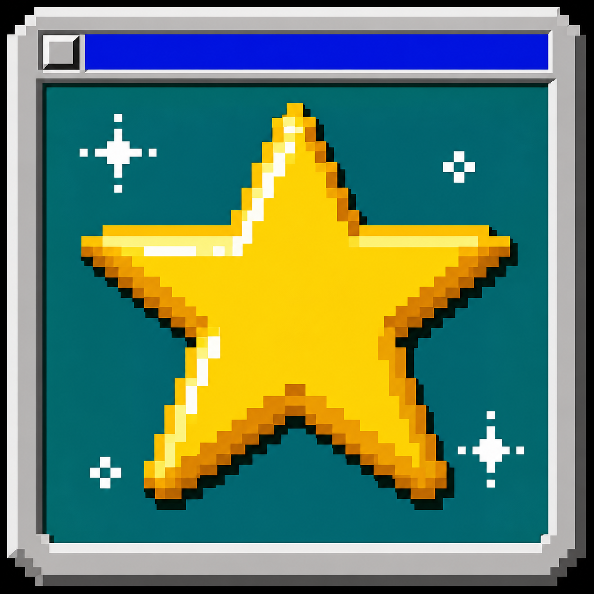

# Scavenger Hunt App

  

An offline, Windows-95-style gymnastics scavenger-hunt coach tool.

The app gives athletes three shuffled gymnastics tasks, unlocks shared class hints when an athlete finishes a set, supports coach-controlled task eligibility, and saves data locally in the browser.

## Included so far

- Complete standalone offline HTML app
- Dedicated hunt-planning workspace for the object, hiding spot, hints, shared skills, and athlete assignments
- Local copy-only LLM hint-prompt builder with no automatic network call
- Cohesive Windows-95 yellow-star app icon
- Project documentation

## App file

- [Open Gymnastics Scavenger Hunt](https://skinnyoracle31415926535.github.io/scavenger-hunt-app/Gymnastics%20Scavenger%20Hunt.html)
- [Download the standalone HTML file](./Gymnastics%20Scavenger%20Hunt.html)

Download the HTML file and open it in a modern browser. All CSS and JavaScript are included, so no installation or hosting is required.
